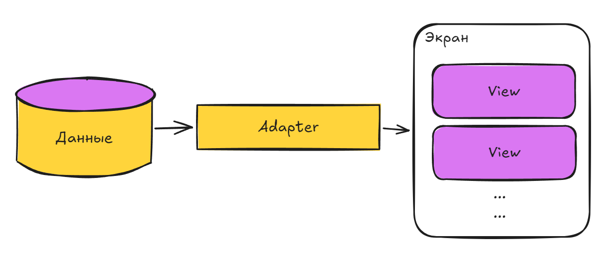

# Урок №15

## Адаптеры. Назначение адаптеров

### Основные правила 

1. Не бойтесь задавать любые вопросы
2. Если хотите сделать что-то свое, то предлагайте – будем думать
3. Советую читать текст, тут написано много полезного
4. 


### О чем этот урок?

Сегодня разберем, как Android связывает данные с элементами интерфейса. Для этого используются **адаптеры** - специальные объекты, которые превращают данные в элементы списка.

---

### Часть 1. Что такое класс?

#### Класс

В Java все строится вокруг **классов**. Класс - это описание объекта: какие данные он хранит и что он умеет делать.

Представьте, что *класс* - это **чертеж**, а *объект* - это **конкретное здание**, построенное по этому чертежу.

```java
public class Student {
    // Поля (данные)
    private String name;
    private int age;

    // Конструктор
    public Student(String name, int age) {
        this.name = name;
        this.age = age;
    }

    // Метод (поведение)
    public String getName() {
        return name;
    }
    // Метод (поведение)
    public void sayHello() {
        System.out.println("Привет, меня зовут " + name);
    }
}
```

**Поля** - это переменные, которые хранят данные объекта. В примере выше - `name` и `age`.

**Конструктор** - это специальный метод, который вызывается при создании объекта. Он инициализирует поля.

**Методы** - это функции, которые описывают поведение объекта.

#### Создание объекта

```java
Student student = new Student("Иван", 20);
student.sayHello(); // Выведет: Привет, меня зовут Иван
```

Ключевое слово `new` создает новый объект класса `Student`.

---

### Часть 2. Зачем нужны адаптеры?

#### Проблема

Допустим, у вас есть список строк:

```java
List<String> names = new ArrayList<>();
names.add("Иван");
names.add("Мария");
names.add("Петр");
```

Как отобразить эти данные в `ListView`? Нужно как-то превратить каждую строку в элемент интерфейса.

#### Решение

**Адаптер** - это объект, который связывает данные с элементами списка. Он берет данные и превращает их в View, которые отображаются на экране:



---

### Часть 3. Типы адаптеров

#### ArrayAdapter

Самый простой адаптер. Подходит для списков из одного типа элементов.

```java
List<String> names = new ArrayList<>();
names.add("Иван");
names.add("Мария");
names.add("Петр");

ArrayAdapter<String> adapter = new ArrayAdapter<>(
    this,                           // Контекст
    android.R.layout.simple_list_item_1, // Макет элемента
    names                          // Данные
);

ListView listView = findViewById(R.id.list_view);
listView.setAdapter(adapter); // привязываем адаптер к списку
```

**Параметры конструктора:**

1. **Context** - контекст приложения (обычно `this`).
2. **Layout** - макет элемента списка. `android.R.layout.simple_list_item_1` - стандартный макет с одним `TextView`.
3. **Data** - список данных.

#### BaseAdapter

Более гибкий адаптер. Позволяет создавать собственные макеты и управлять каждым элементом вручную.

```java
public class MyAdapter extends BaseAdapter {
    private Context context;
    private List<String> items;

    // конструктор, в который передаем список
    public MyAdapter(Context context, List<String> items) {
        this.context = context;
        this.items = items;
    }

    // метод который возвращает количество элементов
    @Override
    public int getCount() {
        return items.size();
    }

    // метод который возвращает элемент по номеру
    @Override
    public Object getItem(int position) {
        return items.get(position);
    }

    // метод который возвращает номер
    @Override
    public long getItemId(int position) {
        return position;
    }

    // метод который создает/переиспользует View для элемента
    @Override
    public View getView(int position, View convertView, ViewGroup parent) {
        // Создаем или переиспользуем View
        if (convertView == null) {
            LayoutInflater inflater = LayoutInflater.from(context);
            convertView = inflater.inflate(R.layout.item_my, parent, false);
        }

        TextView textView = convertView.findViewById(R.id.text_item);
        textView.setText(items.get(position));

        return convertView;
    }
}
```

**Основные методы:**

- `getCount()` - возвращает количество элементов.
- `getItem(int position)` - возвращает элемент по позиции.
- `getItemId(int position)` - возвращает идентификатор элемента.
- `getView(int position, View convertView, ViewGroup parent)` - создает или переиспользует View для элемента.

---

### Часть 4. Переиспользование View

Когда вы прокручиваете список, элементы, которые уходят за пределы экрана, не уничтожаются. Вместо этого они **переиспользуются** для отображения новых данных.

Параметр `convertView` в методе `getView()` - это как раз переиспользуемый View. Если он равен `null`, нужно создать новый View. Если не равен `null` - можно использовать существующий.

```java
@Override
public View getView(int position, View convertView, ViewGroup parent) {
    if (convertView == null) {
        // Создаем новый View
        LayoutInflater inflater = LayoutInflater.from(context);
        convertView = inflater.inflate(R.layout.item_my, parent, false);
    }

    // Заполняем данными
    TextView textView = convertView.findViewById(R.id.text_item);
    textView.setText(items.get(position));

    return convertView;
}
```

---

### Часть 5. Практический пример

#### Задание

Создайте приложение, которое отображает список городов с помощью `ArrayAdapter`.

#### Решение

```java
public class MainActivity extends AppCompatActivity {
    @Override
    protected void onCreate(Bundle savedInstanceState) {
        super.onCreate(savedInstanceState);
        setContentView(R.layout.activity_main);

        ListView listView = findViewById(R.id.list_view);

        List<String> cities = new ArrayList<>();
        cities.add("Москва");
        cities.add("Санкт-Петербург");
        cities.add("Новосибирск");
        cities.add("Екатеринбург");

        ArrayAdapter<String> adapter = new ArrayAdapter<>(
            this,
            android.R.layout.simple_list_item_1,
            cities
        );

        listView.setAdapter(adapter);
    }
}
```

#### Проверка

Запустите приложение. Вы должны увидеть список городов.

---

### Итог

- **Класс** - это описание объекта: данные (поля) и поведение (методы)
- **Адаптер** - это объект, который связывает данные с элементами списка
- **ArrayAdapter** - простой адаптер для списков из одного типа элементов
- **BaseAdapter** - гибкий адаптер для создания собственных макетов
- **Переиспользование View** - элементы списка не создаются заново, а переиспользуются при прокрутке
