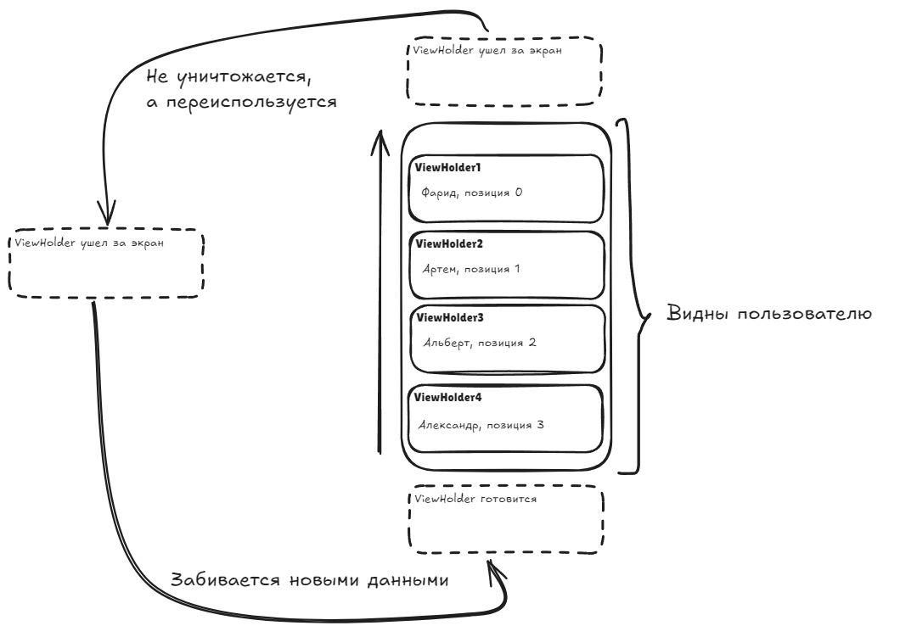

# Урок №17

## RecyclerView

### Основные правила 

1. Не бойтесь задавать любые вопросы
2. Если хотите сделать что-то свое, то предлагайте – будем думать
3. Советую читать текст, тут написано много полезного
4. 


### О чем этот урок?

Сегодня познакомимся с **RecyclerView** - более современным и гибким способом отображения списков. Он пришёл на смену `ListView` 

---

### Часть 1. Что такое RecyclerView?

#### Объяснение

**RecyclerView** - это контейнер для отображения списков. В отличие от `ListView`, он:

- Переиспользует элементы при прокрутке (как и `ListView`, но более эффективно)
- Позволяет легко менять расположение элементов (вертикальный список, горизонтальный списка, сетка)
- Поддерживает анимации добавления и удаления элементов
- Требует использования **ViewHolder** - паттерна для оптимизации

#### Сравнение с ListView

| Характеристика | ListView | RecyclerView |
| --- | --- | --- |
| Переиспользование View | Да | Да |
| ViewHolder | Необязательно | Обязателен |
| Горизонтальный список | Сложно | Легко |
| Сетка | Нет | Да |
| Анимации | Нет | Да |
| Производительность | Средняя | Высокая |

---

### Часть 2. Компоненты RecyclerView


#### RecyclerView

Сам контейнер. Добавляется в макет:

```xml
<androidx.recyclerview.widget.RecyclerView
    android:id="@+id/recycler_view"
    android:layout_width="match_parent"
    android:layout_height="match_parent" />
```

#### LayoutManager

Определяет, как элементы располагаются на экране:

- **LinearLayoutManager** - вертикальный или горизонтальный список.
- **GridLayoutManager** - сетка.
- **StaggeredGridLayoutManager** - сетка с разной высотой элементов.

```java
RecyclerView recyclerView = findViewById(R.id.recycler_view);
recyclerView.setLayoutManager(new LinearLayoutManager(this));
```

#### Adapter

Связывает данные с элементами списка. Создаёт ViewHolder и заполняет его данными.

```java
BookAdapter adapter = new BookAdapter(books);
recyclerView.setAdapter(adapter);
```

#### ViewHolder

Хранит ссылки на View внутри элемента списка. Избавляет от необходимости каждый раз вызывать `findViewById()`.

```java
public class BookViewHolder extends RecyclerView.ViewHolder {
    TextView textTitle;
    TextView textAuthor;

    public BookViewHolder(View itemView) {
        super(itemView);
        textTitle = itemView.findViewById(R.id.text_title);
        textAuthor = itemView.findViewById(R.id.text_author);
    }
}
```

---

### Часть 3. Как работает RecyclerView?

#### Процесс отображения

1. RecyclerView запрашивает у адаптера количество элементов (`getItemCount()`)
2. Для каждого видимого элемента RecyclerView запрашивает ViewHolder (`onCreateViewHolder()`)
3. RecyclerView заполняет ViewHolder данными (`onBindViewHolder()`)
4. Когда элемент уходит за пределы экрана, его ViewHolder переиспользуется для нового элемента

#### Переиспользование ViewHolder

Представьте, что на экране помещается 10 элементов. При прокруте:

- Элемент, который уходит за верхний край, не уничтожается
- Его ViewHolder передаётся адаптеру для заполнения новыми данными
- Этот же ViewHolder отображается внизу списка



Таким образом, создаётся не 100 View для 100 элементов, а только 10–15.

---

### Часть 4. Практический пример

#### Задание

Создайте приложение, которое отображает список книг с помощью RecyclerView

#### Шаг 1. Создайте модель данных

```java
public class Book {
    private String title;
    private String author;

    public Book(String title, String author) {
        this.title = title;
        this.author = author;
    }

    public String getTitle() { return title; }
    public String getAuthor() { return author; }
}
```

#### Шаг 2. Создайте макет элемента

**item_book.xml**:

```xml
<?xml version="1.0" encoding="utf-8"?>
<LinearLayout xmlns:android="http://schemas.android.com/apk/res/android"
    android:layout_width="match_parent"
    android:layout_height="wrap_content"
    android:orientation="vertical"
    android:padding="16dp">

    <TextView
        android:id="@+id/text_title"
        android:layout_width="wrap_content"
        android:layout_height="wrap_content"
        android:textSize="18sp"
        android:textStyle="bold" />

    <TextView
        android:id="@+id/text_author"
        android:layout_width="wrap_content"
        android:layout_height="wrap_content"
        android:textSize="14sp"
        android:layout_marginTop="4dp" />
</LinearLayout>
```

#### Шаг 3. Создайте ViewHolder

```java
public class BookViewHolder extends RecyclerView.ViewHolder {
    TextView textTitle;
    TextView textAuthor;

    public BookViewHolder(View itemView) {
        super(itemView);

        // находим в разметке ОДНОЙ строчки наши текствьюшки
        // и запоминаем их
        textTitle = itemView.findViewById(R.id.text_title);
        textAuthor = itemView.findViewById(R.id.text_author);
    }
}
```

#### Шаг 4. Создайте адаптер

```java
public class BookAdapter extends RecyclerView.Adapter<BookViewHolder> {
    private List<Book> books;

    // в конструкторе адаптера принимаем список книг
    public BookAdapter(List<Book> books) {
        this.books = books;
    }

    // это метод который создает СТРОЧКИ нашего списка
    @Override
    public BookViewHolder onCreateViewHolder(ViewGroup parent, int viewType) {
        // создаем объект VIEW по нашему XML файлу
        View view = LayoutInflater.from(parent.getContext())
                .inflate(R.layout.item_book, parent, false);

        // и сразу привязываем его к нашему "ДЕРЖАТЕЛЮ" (HOLDER)
        return new BookViewHolder(view);
    }

    // метод который привязывает элемент к СТРОЧКЕ (или же к Holder)
    @Override
    public void onBindViewHolder(BookViewHolder holder, int position) {
        Book book = books.get(position); // Берем книгу по номеру в списке
        holder.textTitle.setText(book.getTitle()); // достаем из него название
        holder.textAuthor.setText(book.getAuthor()); // и автора тоже
    }

    // метод который возвращает количество элементов в списке
    @Override
    public int getItemCount() {
        return books.size(); 
    }
}
```

#### Шаг 5. Подключите RecyclerView в Activity

```java
public class MainActivity extends AppCompatActivity {

    List<Book> books = new ArrayList<>();

    @Override
    protected void onCreate(Bundle savedInstanceState) {
        super.onCreate(savedInstanceState);
        setContentView(R.layout.activity_main);
        
        // 6000 раз добавляем книги в список
        for (int i = 0; i < 6000; i++) {
            loadData();
        }
        BookAdapter adapter = new BookAdapter(books); // создаем адаптер и помещаем в него список

        RecyclerView recyclerView = findViewById(R.id.recycler_view); // находим на экране рекуклервью
        recyclerView.setLayoutManager(new LinearLayoutManager(this)); // делаем вертикальную прокрутку
        recyclerView.setAdapter(adapter); // привязываем наш адаптер к списку
    }

    private void loadData() {
        books.add(new Book("Война и мир", "Лев Толстой"));
        books.add(new Book("Преступление и наказание", "Фёдор Достоевский"));
        books.add(new Book("Мастер и Маргарита", "Михаил Булгаков"));
    }
}
```

#### Проверка

Запустите приложение. Вы должны увидеть список книг, который прокручивается плавно

---

### Часть 5. Горизонтальный список

RecyclerView позволяет легко изменить ориентацию списка. Для этого нужно использовать `LinearLayoutManager` с горизонтальной ориентацией:

```java
LinearLayoutManager layoutManager = new LinearLayoutManager(this);
layoutManager.setOrientation(LinearLayoutManager.HORIZONTAL);
recyclerView.setLayoutManager(layoutManager);
```

Теперь список будет прокручиваться горизонтально.

---

### Итог

- **RecyclerView** - современный контейнер для отображения списков
- **LayoutManager** определяет расположение элементов (вертикальное, горизонтальное, сетка)
- **Adapter** связывает данные с элементами списка
- **ViewHolder** хранит ссылки на View и оптимизирует производительность
- RecyclerView переиспользует ViewHolder при прокрутке, что делает его более производительным, чем ListView
