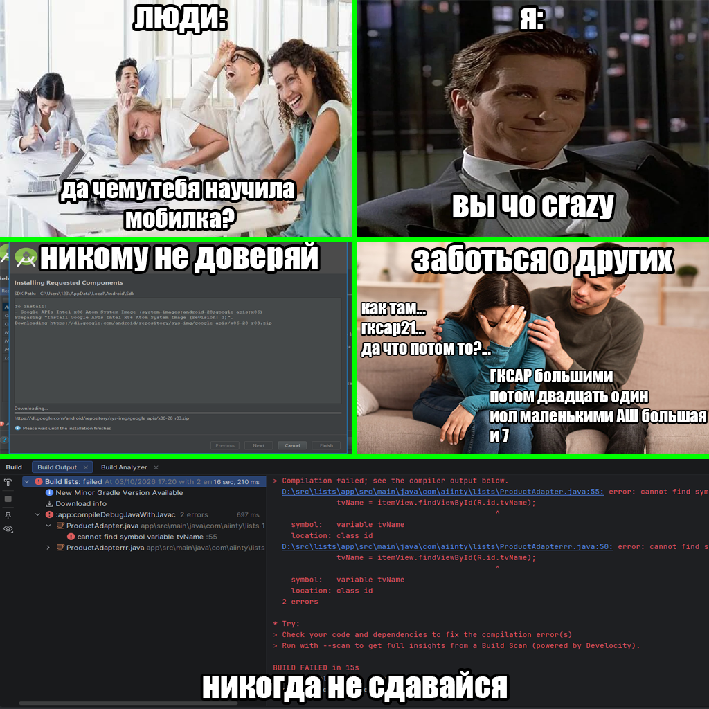

# Лабораторная работа №19

## Реализация гетерогенного и горизонтального RecyclerView

### Основные правила

1. Не бойтесь задавать любые вопросы
2. Если хотите сделать что-то свое, то предлагайте – будем думать
3. Советую читать текст, тут написано много полезного
4. 


### О чем лабораторная?

На прошлых занятиях вы научились создавать списки с помощью RecyclerView. Сегодня расширим эти знания: создадим список с разными типами элементов и научимся располагать элементы горизонтально.

---

### Часть 1. Теория

#### Гетерогенный список

Представим приложение с лентой новостей.

Обычная новость **содержит заголовок и текст**. Важная новость дополнительно **содержит изображение и специальную отметку**.

Например:

* Обычная новость: "Сегодня солнечно" и краткий текст
* Важная новость: "В городе открыли новый парк", текст, изображение и отметка "Важно"

Обе записи являются новостями и находятся в одном списке, но выглядят по-разному.

Такой список называется ***гетерогенным***. Это означает, что в нём могут находиться элементы разных типов, каждый со своим внешним видом.

#### Что нужно изменить в программе?

Чтобы создать такой список, недостаточно просто добавить разные записи в коллекцию. **Адаптер должен понимать**, как отображать каждую запись.

##### Шаг 1. Изменить модель

Раньше модель новости могла хранить только заголовок и текст. Теперь ей нужно хранить дополнительную информацию: например, является ли новость важной и какое изображение нужно показать.

```java
public class News {
    public String Title;        // заголовок
    public String Text;         // текст новости
    public int ImageId;         // какая у нас может быть картинка
    public boolean Important;   // ВАЖНАЯ (true) или НЕТ (false)

    public News(String title, String text, int imageId, boolean important) {
        this.Title = title;
        this.Text = text;
        this.ImageId = imageId;
        this.Important = important;
    }
}
```

Например, создание двух записей:

```java
News news1 = new News(
    "Сегодня солнечно", // заголовок
    "Ожидается ясная погода.", // текст
    0,  // 0 потому что картинка не нужна
    false // обычная новость
);

News news2 = new News(
    "Открыли новый парк", // заголовок
    "В городе появилось новое место отдыха.", // текст
    R.drawable.news_picture, // картинка
    true // важная новость
);
```

##### Шаг 2. Создать разные макеты элементов

Для обычной новости создайте макет `item_news.xml`. В нём разместите заголовок и текст.

Для важной новости создайте макет `item_news_important.xml`. В нём разместите заголовок, текст, изображение и, например, надпись "Важно".

Макеты могут содержать разные элементы и отличаться оформлением.

##### Шаг 3. Создать ViewHolder для каждого макета

Каждому макету нужен свой `ViewHolder`, который хранит ссылки на его элементы интерфейса.

Например у нас получается:

* `NewsViewHolder` - для обычной новост
* `ImportantNewsViewHolder` - для важной новости.

Почему нельзя всегда использовать один и тот же ViewHolder? **У разных макетов может быть разный набор элементов.** Например, у обычной новости нет изображения, а у важной оно есть.

Вспомните предыдущие лабораторные: ViewHolder нужен, чтобы хранить ссылки на элементы интерфейса и не искать их заново при каждом обновлении строки.

##### Шаг 4. Научить адаптер создавать нужный макет

У адаптера есть метод `getItemViewType(...)`. Он сообщает RecyclerView, к какому типу относится элемент с указанной позицией.

Например:

```java
@Override
public int getItemViewType(int position) {
    News news = newsList.get(position);

    if (news.isImportant()) {
        return 1;
    }

    return 0;
}
```

Здесь:

* position - позиция новости в списке
* newsList.get(position) - получение новости по этой позиции
* 1 - обозначает что это **ВАЖНАЯ** новость
* 0 - обозначает что это **ОБЫЧНАЯ** новости

Таким образом, адаптер определяет тип **не по внешнему виду элемента**, *а по данным модели*.

В методе `onCreateViewHolder()` нужно проверить полученный `viewType` и создать соответствующий `ViewHolder`:

```java
@Override
public RecyclerView.ViewHolder onCreateViewHolder(ViewGroup parent, int viewType) {
    LayoutInflater inflater = LayoutInflater.from(parent.getContext());

    // если тип РАВЕН 1 (то есть ВАЖНАЯ новость)
    if (viewType == 1) {
        // Создаем ВАЖНУЮ строчку
        View view = inflater.inflate(R.layout.item_news_important, parent, false);
        return new ImportantNewsViewHolder(view);
    }

    // иначе мы создаем ОБЫЧНУЮ
    View view = inflater.inflate(R.layout.item_news, parent, false);
    return new NewsViewHolder(view);
}
```

viewType определяет, какой макет нужно создать. После создания ViewHolder адаптер должен ещё заполнить его данными - это делается в onBindViewHolder().

##### Шаг 5. Научить адаптер заполнять нужный макет

Внутри `onBindViewHolder()` необходимо учитывать тип `ViewHolder` и заполнять соответствующие поля. Например, для обычной новости достаточно заголовка и текста, а для важной дополнительно устанавливается изображение:

```java
@Override
public void onBindViewHolder(RecyclerView.ViewHolder holder, int position) {
    News news = newsList.get(position);
    // проверяем в if ТИП нашей строчки
    if (holder instanceof ImportantNewsViewHolder) {
        // если строчка ВАЖНАЯ
        ImportantNewsViewHolder vh = (ImportantNewsViewHolder) holder;
        vh.textTitle.setText(news.getTitle());
        vh.textText.setText(news.getText());
        vh.imageNews.setImageResource(news.getImageId()); 
    } else {
        // если тип ДРУГОЙ
        NewsViewHolder vh = (NewsViewHolder) holder;
        vh.textTitle.setText(news.getTitle());
        vh.textText.setText(news.getText());
    }
}
```

#### Горизонтальный список

Горизонтальный список прокручивается слева направо. Для этого нужно использовать `LinearLayoutManager` с горизонтальной ориентацией:

```java
LinearLayoutManager layoutManager = new LinearLayoutManager(this);
layoutManager.setOrientation(LinearLayoutManager.HORIZONTAL);
recyclerView.setLayoutManager(layoutManager);
```

---

### Часть 2. Самостоятельная работа

#### Задание

Выберите одну из тем или предложите свою:

1. **Лента новостей** - обычные новости (заголовок + текст) и важные новости (заголовок + текст + изображение)
2. **Каталог товаров** - обычные товары (название + цена) и товары со скидкой (название + цена + старая цена + скидка)
3. **Своя тема** - любой список

Требования к любой теме:

* Создайте модель данных с типом элемента
* Создайте макеты для каждого типа элементов
* Создайте `ViewHolder` для каждого типа элементов
* Создайте адаптер с методом `getItemViewType(int position)`
* Реализуйте условную логику отображения (по теме)

#### Подсказки

Для условного отображения используйте `if` внутри `onBindViewHolder`:

```java
if (movie.getRating() >= 8.0) {
    holder.textRating.setTextColor(Color.GREEN);
} else {
    holder.textRating.setTextColor(Color.BLACK);
}
```

Для обработки клика используйте `setOnClickListener`:

```java
holder.itemView.setOnClickListener(v -> {
    Toast.makeText(v.getContext(), movie.getTitle(), Toast.LENGTH_SHORT).show();
});
```

---

### Требования к итоговой версии

1. Приложение отображает список с разными типами элементов
2. Адаптер корректно определяет тип элемента и использует нужный макет
3. Реализована условная логика отображения
4. Все текстовые данные вынесены в `strings.xml`
