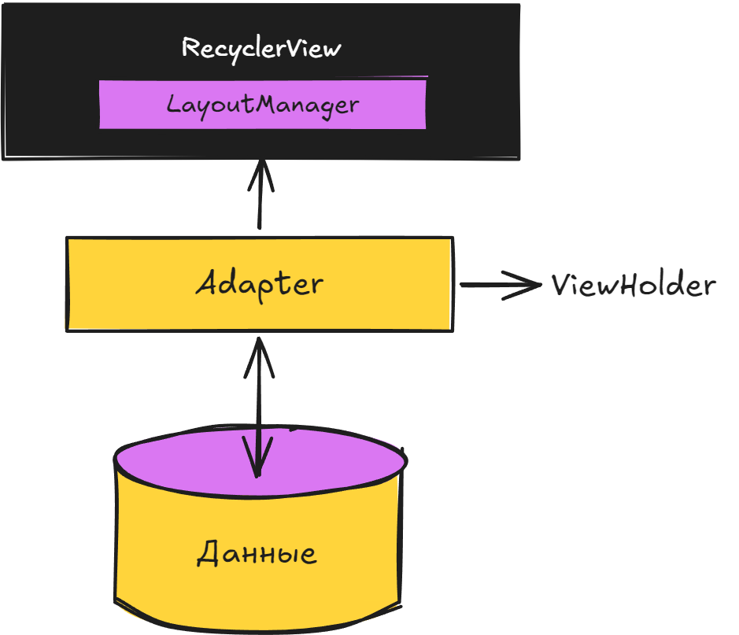

# Урок №6

## Оптимизация работы со списками и представлениями данных

### О чем этот урок?

В приложении пока нет экрана, на котором можно просматривать объявления. Сегодня разберем, как показывать много однотипных данных в прокручиваемом списке без создания отдельного `View` для каждого элемента. Для этого используем `RecyclerView`, модель данных, адаптер и `ViewHolder`

---

### Часть 1. Проблема большого списка

Представьте экран с сотней объявлений. Можно программно создавать для каждого объявления `TextView` и добавлять его в `LinearLayout`, но это плохой вариант: Android придется создать и хранить слишком много View, даже если на экране одновременно видно только шесть.

Нам нужен контейнер, который отображает только видимые элементы, а при прокрутке использует уже созданные элементы повторно. Такой контейнер - **`RecyclerView`**.

`RecyclerView` состоит из четырех частей:

| Часть | За что отвечает |
| --- | --- |
| `RecyclerView` | Показывает прокручиваемый список |
| `LayoutManager` | Решает, как расположить элементы: списком, горизонтально или сеткой |
| `Adapter` | Создает элементы списка и связывает их с данными |
| `ViewHolder` | Хранит ссылки на View внутри одного элемента |



---

### Часть 2. Как работает переиспользование

Пусть в списке 50 объявлений, а на экране помещается 5 карточек. При первом открытии `RecyclerView` создаст примерно 5–7 `ViewHolder`. Когда верхняя карточка уйдет за границу экрана, Android не выбросит ее: адаптер заполнит тот же `ViewHolder` данными следующего объявления.


Поэтому в `ViewHolder` один раз находятся ссылки на `TextView`, а в `onBindViewHolder()` только меняются тексты. Не нужно вызывать `findViewById()` при каждой прокрутке.

Схема работы адаптера:

1. `onCreateViewHolder()` создает View для новой строки списка;
2. `onBindViewHolder()` заполняет эту строку данными элемента по позиции;
3. `getItemCount()` сообщает, сколько элементов находится в списке.

---

### Часть 3. Модель данных объявления

Перед отображением данных опишем одно объявление отдельным классом. Пока данные хранятся только в памяти приложения - позже вместо локального списка мы будем загружать объявления с учебного бекенда.

```java
public class Item {
    private final String title;
    private final String price;
    private final String description;

    public Item(String title, String price, String description) {
        this.title = title;
        this.price = price;
        this.description = description;
    }

    public String getTitle() {
        return title;
    }

    public String getPrice() {
        return price;
    }

    public String getDescription() {
        return description;
    }
}
```

Один объект `Item` - одно объявление. `ArrayList<Item>` станет источником данных для адаптера. Названия полей совпадают с данными, которые будут приходить с сервера, - так позже будет проще подключить загрузку объявлений

---

### Часть 4. Подключение RecyclerView

В разметку экрана добавьте сам список:

```xml
<androidx.recyclerview.widget.RecyclerView
    android:id="@+id/rv_items"
    android:layout_width="match_parent"
    android:layout_height="match_parent" />
```

Затем в `Activity` укажите, что объявления идут вертикально:

```java
RecyclerView recyclerView = findViewById(R.id.rv_items);
recyclerView.setLayoutManager(new LinearLayoutManager(this));
```

Без `LayoutManager` список не сможет расположить элементы на экране.

---

### Часть 5. Адаптер и ViewHolder

Для примера используем простой макет `row_item.xml` с тремя `TextView`: `tv_title`, `tv_price` и `tv_description` - **не забудьте его самостоятельно создать**.

Сначала создадим `ViewHolder` для нашего объявления, он будет хранить ссылки на наши TextView:

```java
public class ItemViewHolder extends RecyclerView.ViewHolder {
    TextView tvTitle;
    TextView tvPrice;
    TextView tvDescription;

    public ItemViewHolder(@NonNull View itemView) {
        super(itemView);

        tvTitle = itemView.findViewById(R.id.tv_title);
        tvPrice = itemView.findViewById(R.id.tv_price);
        tvDescription = itemView.findViewById(R.id.tv_description);
    }
}
```

Затем создадим сам адаптер, который свяжет наши данные с контейнером `RecyclerView`:

```java
public class ItemAdapter extends RecyclerView.Adapter<ItemViewHolder> {

    private final List<Item> items;

    // конструтор который принимает список
    public ItemAdapter(List<Item> items) {
        this.items = items;
    }

    // это метод который создает СТРОЧКИ (или же Holder) нашего списка
    @Override
    public ItemViewHolder onCreateViewHolder(ViewGroup parent, int viewType) {
        View view = LayoutInflater.from(parent.getContext())
                .inflate(R.layout.row_item, parent, false);
        return new ItemViewHolder(view);
    }

    // метод который привязывает элемент к СТРОЧКЕ (или же к Holder)
    @Override
    public void onBindViewHolder(@NonNull ItemViewHolder holder, int position) {
        Item item = items.get(position);
        holder.tvTitle.setText(item.getTitle());
        holder.tvPrice.setText(item.getPrice());
        holder.tvDescription.setText(item.getDescription());
    }

    // метод который возвращает количество элементов в списке
    @Override
    public int getItemCount() {
        return items.size();
    }
}
```

Обратите внимание: `onCreateViewHolder()` не должен заполнять текстами конкретное объявление. **Он только создает View.** Конкретные данные появляются в `onBindViewHolder()`

---

### Часть 6. Практический пример

Создадим несколько локальных объявлений и передадим их адаптеру:

```java
List<Item> items = new ArrayList<>();
items.add(new Item("Велосипед", "12 000 ₽", "Городской велосипед в хорошем состоянии"));
items.add(new Item("Учебник Java", "700 ₽", "Книга для начинающих разработчиков"));
items.add(new Item("Настольная лампа", "1 500 ₽", "Светодиодная лампа для рабочего стола"));

RecyclerView recyclerView = findViewById(R.id.rv_items);
recyclerView.setLayoutManager(new LinearLayoutManager(this));
recyclerView.setAdapter(new ItemAdapter(items));
```

Запустите приложение и прокрутите список. Добавьте еще несколько объявлений. Код адаптера при этом не меняется: он работает с любым количеством объектов `Item`

---

### Итог

* `RecyclerView` отображает длинные списки и переиспользует элементы при прокрутке
* `LayoutManager` задает способ расположения элементов
* модель `Item` хранит данные одного объявления
* Adapter связывает список объектов с разметкой элемента
* `ViewHolder` сохраняет ссылки на View и помогает не выполнять лишнюю работу

На следующем занятии вы самостоятельно соберете экран объявлений и оформите каждый элемент в виде карточки
